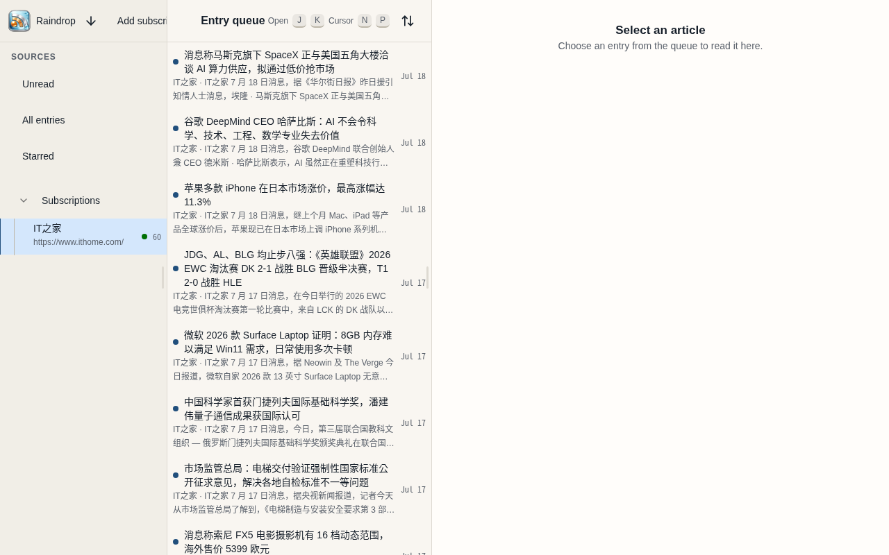
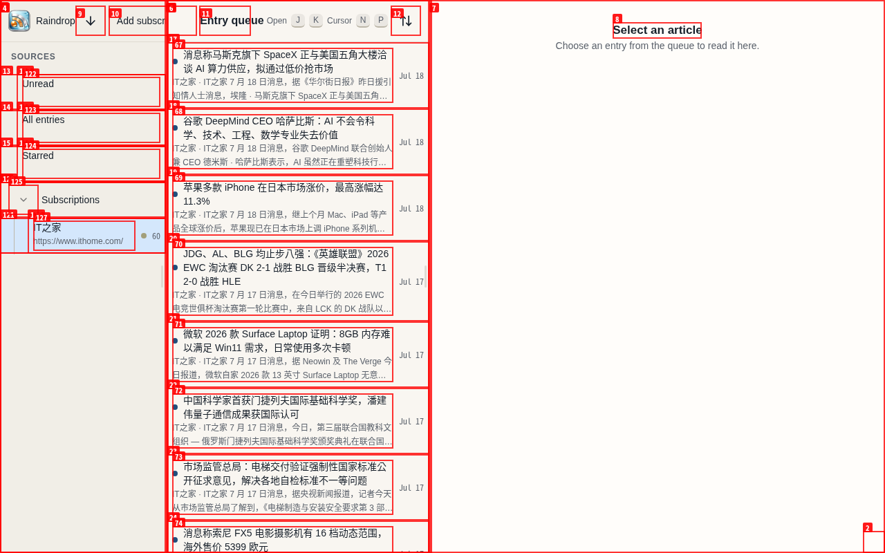
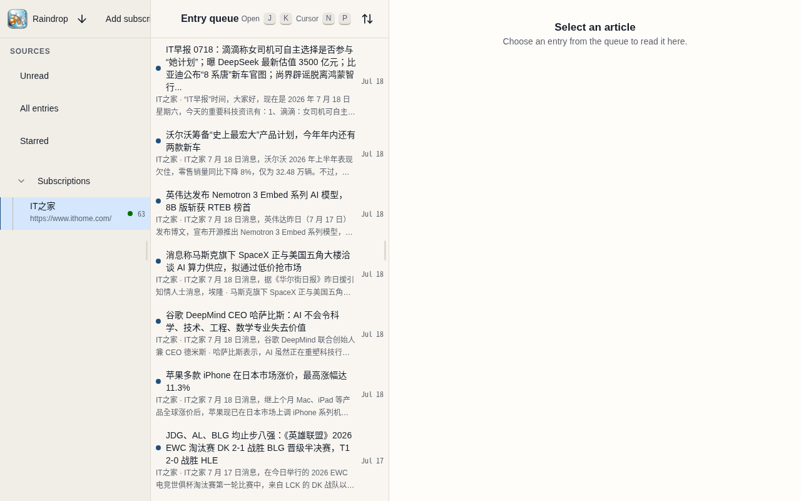
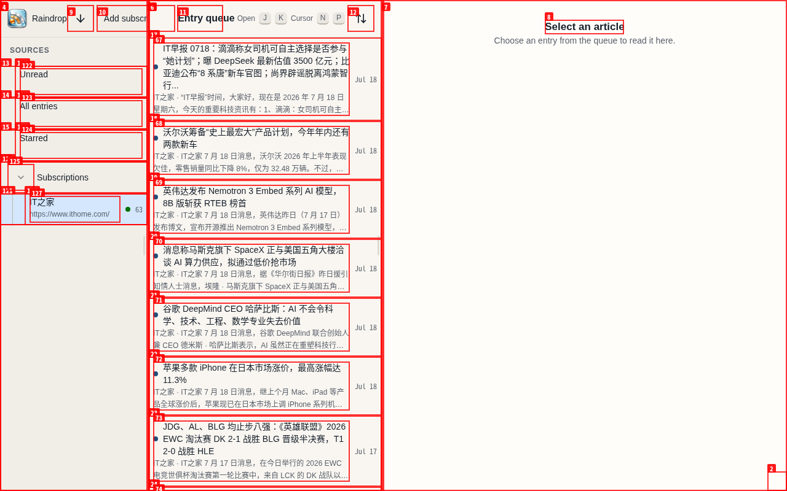

# Task 4B real RSS browser verification

| Field | Value |
|---|---|
| Date | 2026-07-18 |
| App URL | http://127.0.0.1:8080 |
| Session | raindrop-task4b-dc3d22ea96f1 |
| Feed | https://www.ithome.com/rss/ |
| Scope | Setup, real subscription and refresh, stored reload, article/back navigation, responsive overflow, browser console |

## Summary

| Severity | Count |
|---|---:|
| Critical | 0 |
| High | 0 |
| Medium | 2 |
| Low | 0 |
| **Total** | **2** |

## Verification log

- Completed first-run SQLite setup and administrator creation in the production binary.
- Added `https://www.ithome.com/rss/`; the worker fetched, parsed, sanitized, and persisted 60 unread entries.
- Confirmed a full reload reconciles the subscription to `IT之家 / Refresh complete / 60`.
- Confirmed `Reload stored entries` sends only `GET /api/v1/entries?...`.
- Confirmed network refresh sends `POST /api/v1/subscriptions/{id}/refresh` and returns `202`.
- Opened a real IT之家 article, verified readable sanitized content, desktop browser Back, and compact Back-to-queue navigation.
- Verified queue and article containment at 1280×800, 900×800, 390×844, and 360×800. In every case document and body scroll width equaled the viewport width.
- Playwright production suite: 14/14 passed before this exploratory pass.

## Issues

### ISSUE-001: Refresh completion is not reconciled until a full page reload

| Field | Value |
|---|---|
| Severity | medium |
| Category | functional / UX |
| URL | `/reader/feed/5fe7228f-f0d1-431e-a5ae-cab1b35a7d12` |
| Repro Video | [videos/issue-001-refresh-state.webm](videos/issue-001-refresh-state.webm) |

**Description**

Starting a manual refresh immediately changes the subscription to `Refresh queued`, but the UI never observes the terminal refresh state. The backend completes successfully and a full reload shows `Refresh complete`; without that reload the source status stays queued indefinitely.

**Repro Steps**

1. Start from the completed subscription state.
   
2. Click `Refresh IT之家`; the request returns `202` and the status becomes queued.
   
3. Wait after backend completion; the current UI remains queued.
   
4. Reload the page; the same subscription immediately shows complete again.
   

**Resolution verification**

Resolved in the Task 4B implementation. The client now performs a bounded, abortable status reconciliation using `GET /api/v1/subscriptions/{id}` after accepted create/refresh operations. A production retest observed one POST followed by two GET polls, then `Refresh complete / 63` without a page reload.

### ISSUE-002: Production UI floods the browser console with uncompiled Lingui warnings

| Field | Value |
|---|---|
| Severity | medium |
| Category | console / performance |
| URL | all setup, login, and Reader routes |
| Repro Video | N/A |

**Description**

The production bundle loads most translations as raw strings. Every translated render emits `Uncompiled message detected`, including once per visible entry status. A 60-entry feed produces thousands of repeated warning lines, obscuring real errors and adding avoidable development/diagnostic overhead. The same catalog shape also caused `{count}` and `{title}` to render literally before the Task 4B interpolation fix.

**Repro Steps**

1. Open the production application and navigate to a populated feed.
2. Run `agent-browser --session raindrop-task4b-dc3d22ea96f1 console`.
3. Observe repeated `Uncompiled message detected!` warnings for setup labels, Reader labels, and every `Unread entry` status.

**Resolution verification**

Resolved in the Task 4B implementation. All static catalog entries are loaded in Lingui compiled-message form, placeholder-bearing entries remain explicitly compiled, and a regression test covers English/Chinese interpolation. After rebuilding the production binary, both `agent-browser console` and `agent-browser errors` returned no output across login and the populated Reader.
