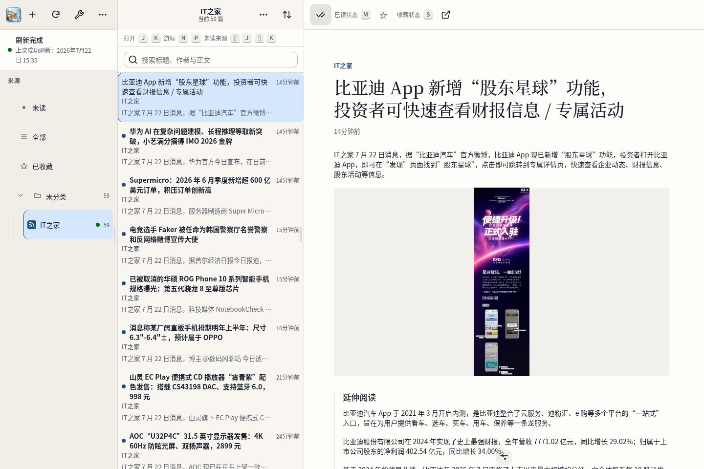
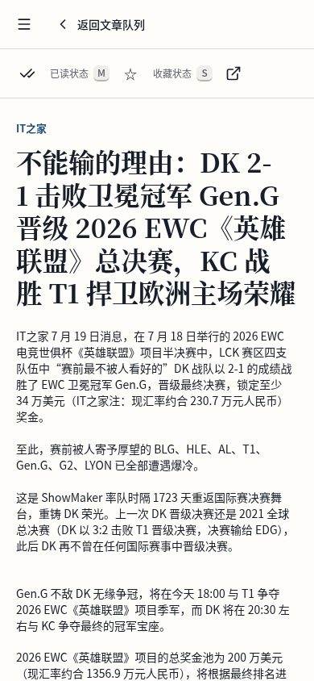

# Raindrop

Raindrop 是使用 Rust、Axum、SeaORM 和 React 构建的自托管 RSS 阅读器。它提供安全的 Feed 抓取与正文清洗、分类管理、未读与收藏状态、Feed 内搜索、批量已读、键盘导航、响应式阅读界面，以及 SQLite、PostgreSQL、MySQL 三种数据库支持。生产 Web 界面会嵌入单个 Rust 可执行文件。

## v0.4.3

- 自定义正文字体新增 TTF 与 OTF 支持，原有 WOFF2 继续可用；上传、存储和浏览器加载会按字体格式正确处理。
- 每个订阅在来源列表中新增快速全部已读操作，无需先切换订阅；确认时按最新快照处理，之后到达的文章仍保持未读。

## v0.4.2

- 登录界面改为独立的 `/login` 页面；未登录、退出登录与会话失效都会同步更新地址，登录完成后进入阅读器首页。
- S3 与 WebDAV 新增目标表单使用统一字段槽位，同一行的输入框、说明文字和列宽保持对齐；Path-style 开关改为更清晰的整列布局。
- 来源侧栏、RSS 文章列表与设置页补充清晰的悬停、按压、选中和键盘焦点状态，并在浅色、暗色与三档密度下保持稳定层级。
- 设置、登录与插件说明改为功能性文案；正文排版保持不变，来源、队列、设置和正文滚动条改为低干扰样式。

## v0.4.1

- 左侧来源树按紧凑、均衡、宽松三档分别收紧订阅行高与图标尺寸，桌面端减少无效留白，触屏设备继续保留 44px 可点击区域。
- 修复添加订阅完成后再次打开管理窗口仍显示上一次 Feed 地址的问题；当前流程返回 URL 时仍可继续编辑原地址。

## v0.4.0

- 新增独立订阅备份模块：可配置多个 S3 与多个 WebDAV 目标，同一次手动或定时任务可以跨类型多选并分别记录结果。
- 备份使用标准明文 OPML，包含订阅与分类；远端目标支持按数量和天数独立清理，任务记录保留最近一周，访问凭据继续加密保存且不回显。
- 设置页改为固定图标导航与独立内容滚动，新增关于/版本页，字体删除收敛为紧凑图标操作。
- 添加订阅完成后自动关闭管理窗口，选中订阅可显式执行快照安全的全部已读。

## v0.3.9

- 阅读队列标题改为当前来源名称，并显示当前可见文章数；正文标题下补充作者与相对发布时间，浏览上下文更清楚。
- 队列与正文重新梳理信息层级和阅读密度，桌面端与移动端截图同步更新为真实 RSS 内容。
- 选区操作、AI 侧栏、设置与订阅页签加入克制的短动效，并为减少动态效果偏好保留柔和过渡。
- 生产构建会跟踪 Web bundle 内容摘要，前端资源变化后 Rust release binary 会自动重新嵌入最新界面。

## v0.3.8

- DeepLX 全文翻译新增默认开启的渐进模式，标题和段落完成后立即显示；后续请求失败时保留已经完成的译文。
- 修复来源树全部展开后无法滚动到最后的问题，底部订阅现在可以完整显示和操作。
- 来源树悬停与选中状态使用不同颜色，嵌套订阅不会继承父级的选中背景。
- AI Provider 类型明确提供 Claude / Anthropic Messages、OpenAI Responses、OpenAI Chat Completions 和 Google Gemini，新增 Provider 默认使用 OpenAI Responses。

## v0.3.7

- 选中正文后在选区末端显示轻量翻译按钮；桌面端拖选释放即可操作，移动端复用系统长按选区并在选区稳定后显示 44px 触控按钮。
- 查词或段落翻译只在点击浮动按钮后发起，右键恢复浏览器原生菜单；结果浮层从触发点居中展开，并在窄屏保留安全边距。
- 修复分类名称的文字基线与来源树按钮触控区域，分类图标、名称和计数在桌面与移动布局中保持稳定对齐。

## v0.3.6

- 修复翻译请求进行中无法切换文章或打开其他页面的问题；耗时网络请求不再进入 React transition，阅读导航始终即时响应。
- 选中正文后右键会在指针附近直接打开浮动翻译框，不再使用单行输入框或菜单式二次触发。
- 短文本自动查词并可在浮层内切换为翻译，段落选区自动直接翻译；关闭浮层、切换动作或离开文章时会取消过期请求。
- 新增受认证保护的选区翻译接口，复用用户保存的 OpenAI 或 DeepLX 配置，并限制文本长度、并发、速率和执行时间。

## v0.3.5

- 设置页改为更宽的个人、阅读和插件分区，支持编辑昵称与登录邮箱，移动端也能完整浏览表单。
- 插件管理改为 AI Provider、AI Assistant 与翻译三个独立入口；Provider 只管理连接，AI Assistant 专注摘要、归纳与要点提炼。
- 新增独立翻译插件，支持 OpenAI 与 DeepLX；DeepLX API Key 可选、按用户加密保存，也可通过 Base URL 的 `{{apiKey}}` 路径占位符传递。
- OpenAI 翻译内置通用、技术、文学、学术、商务和新闻社媒六套专家 Prompt，并支持自定义 Prompt 与整篇文章分批翻译。
- 阅读器支持仅译文、原文加译文、悬停显示和左右对照四种模式，并提供选中文本查词。
- 点击未读条目打开正文时会立即同步为已读，列表状态、未读数量和服务端记录保持一致。
- 分类名称、图标和未读数保持同一基线，文章显示相对更新时间；正文图片使用稳定占位并通过同源代理加载，减少滚动时的跳动和闪烁。
- 正文显示工具条补齐 44px 触控目标、8px 间距和键盘焦点反馈，桌面悬停与触屏展开各自使用合适的交互方式。

## v0.3.4

- 来源栏的 `+` 只负责添加订阅、分类与 OPML；选中 Feed 后使用独立编辑按钮查看真实 Feed 地址，并修改名称、分类或删除订阅。
- 正文显示控制改为底部按需工具条：桌面端靠近正文底部时出现，触屏设备通过小型入口展开，字体与正文主题使用独立级联菜单。
- 正文图片在稳定占位中短暂淡入，加载失败仍保留固定错误框，减少阅读过程中的尺寸跳动。
- 关闭状态的字体与主题 Popover 不再误判为活动弹窗，J/K/N/P/M/S 快捷键保持可用。

## v0.3.3

- 订阅、分类和 OPML 集中到同一个管理入口，当前订阅会分别显示真实 Feed 地址与网站地址。
- 分类行图标与名称保持同一基线，文章列表新增相对更新时间，长标题和多语言内容更容易扫读。
- 字体与字号调整移到正文浮动工具栏，设置页新增用户私有的 WOFF2 字体上传与删除，每位用户最多保存 8 个、单个最大 5 MiB。
- 图片代理支持 AVIF，正文图片使用稳定尺寸占位；滚动、切换布局或加载失败时不再反复收缩、闪烁。
- 收紧正文行宽、标题层级和段落节奏，滚动条与浮动工具栏改为更低干扰的阅读样式。

## v0.3.2

- Docker 多架构发布改为 amd64 与 arm64 原生 runner 并行构建，移除耗时超过两小时的 QEMU Rust release 编译，再合并并校验多架构 manifest。
- Docker builder 固定使用镜像自带的 Rust 1.94.0 toolchain，避免生产构建额外安装 Clippy 等无关组件。

## v0.3.1

- 阅读器恢复经过清洗的远程图片，优化长内容与滚动条，并在正文末尾提供“打开原文”。
- 新增个人、阅读、插件与订阅设置；支持正文字体、配色、字号、工具栏快捷缩放和链接打开方式。
- AI 移入插件管理并支持总开关；SQLite 安装自动创建持久化 Provider key，首次启动即可添加 Provider。
- 来源树、工具栏、弹窗和 Feed 管理采用更紧凑的阅读器结构，安全代理并显示站点 favicon，支持修改订阅名称、分类、打开站点和删除订阅。

## v0.3.0

- 新增用户级 AI Provider 管理，支持 Anthropic Messages-compatible、OpenAI Responses、OpenAI Chat Completions-compatible 和 Google Gemini，credential 仅写入且加密保存。
- Reader 新增手动摘要与翻译 sidecar，任务执行、轮询和失败重试均不阻塞原文，关闭或切换后保留正文与滚动位置。
- 官方签名 `raindrop.ai-content@1.0.0` 通过统一 Provider broker、当前 artifact identity 和类型化结果合同执行，未配置 keyring 时保持惰性。
- bootstrap 管理员配置与 Web 设置统一为密码只要求非空；生产部署仍建议使用密码管理器生成强密码。

## 界面预览

桌面端同时呈现来源、文章队列和正文；移动端收敛为专注阅读视图。以下截图来自本地 `v0.4.0` 实例实际订阅并刷新 `https://www.ithome.com/rss/` 后的界面。



<p align="center">
  
</p>

当前 binary 会内嵌、验签并编译官方 `raindrop.ai-content@1.0.0` Wasm Component。完成设置后，进程会把该 installation 幂等同步到数据库。SQLite 和交互式设置会在数据目录中创建持久化 `provider-secret.key`；显式配置 `RAINDROP_PROVIDER_SECRET_KEYS` 时始终优先使用配置的可轮换 keyring。用户可以在“设置 > 插件”中管理 Anthropic Messages-compatible、OpenAI Responses、OpenAI Chat Completions-compatible 和 Google Gemini Provider，AI Assistant 负责摘要与归纳，独立翻译插件负责 OpenAI 或 DeepLX 全文翻译与查词。Provider Credential 和 DeepLX API Key 均只写入、按用户加密保存，不会从 API 或界面回读；摘要与译文都不替换原文，关闭、切换或执行失败不会阻塞阅读。自动入队、Feed 生命周期投递、MCP transport 和第三方插件分发仍是后续工作。

## 环境要求

- Rust 1.94.0，仓库中的 `rust-toolchain.toml` 会选择该版本。
- `wasm32-unknown-unknown` target；仓库工具链文件、CI 和 Docker builder 会自动安装。
- Node.js 26.4.0 和 npm 12.0.1。

仓库提交了 `Cargo.lock` 与 `web/package-lock.json`。安装前端依赖时禁用依赖脚本，并使用 `npm ci` 保持锁文件不变。

## 交互式 SQLite 首次启动

先构建生产 Web 资源和 release binary：

```bash
npm --prefix web ci --ignore-scripts
npm --prefix web run build
cargo build --release --locked
mkdir -p data
chmod 700 data
./target/release/raindrop
```

终端会输出一次性 setup token。打开 `http://127.0.0.1:8080`，输入该 token，保留向导默认的 `sqlite://data/raindrop.db?mode=rwc`，再创建管理员。向导完成后会写入 `data/config.toml`，同一进程随即进入登录状态。

setup token 只应出现在受控终端中。不要把它写入命令行参数、截图、日志收集或工单。若在完成设置前重启，旧 token 会失效，新进程会生成新的 token。

## 环境托管初始化

`.env.example` 包含安全的本地默认值和明确的秘密占位符。Raindrop 不会自动读取 `.env`，可以由 shell、容器平台或服务管理器注入变量。

```bash
cp .env.example .env
${EDITOR:-vi} .env
mkdir -p data
chmod 700 data
set -a
. ./.env
set +a
./target/release/raindrop
```

启动前必须替换 `RAINDROP_BOOTSTRAP_ADMIN_PASSWORD` 占位符。数据库没有用户时，完整的 `RAINDROP_BOOTSTRAP_ADMIN_USERNAME` 和 `RAINDROP_BOOTSTRAP_ADMIN_PASSWORD` 会创建首位管理员。创建成功后，应从部署环境中删除整组 `RAINDROP_BOOTSTRAP_ADMIN_*` 变量；只保留用户名会被视为不完整配置。已有用户不会被完整的 bootstrap 变量覆盖。

SQLite 会在数据目录中自动创建独立的 `provider-secret.key`，无需额外变量即可在“设置 > 插件”中添加 Provider。PostgreSQL/MySQL 环境托管部署应注入 `RAINDROP_PROVIDER_SECRET_KEYS`；显式配置也用于多实例共享和密钥轮换。完整格式、轮换和备份规则见 [AI Provider 运维合同](docs/ai-providers.md)。

变量、TOML 字段、优先级、反向代理和数据库说明见 [配置文档](docs/configuration.md)。

## Docker

镜像内的进程以 `10001:10001` 运行，监听 `0.0.0.0:8080`，数据目录固定为 `/data`。运行镜像不包含 Node.js、npm、Cargo、rustc 或源码。

本地构建镜像：

```bash
docker build --tag raindrop:dev .
```

本地普通 binary 和镜像使用公开、确定性的 development 签名根，并在启动内容 runtime 时明确记录该模式，只适合开发和 CI smoke。正式 tag binary 与 Docker 发布必须使用受保护的官方 seed，不能回退到 development 签名。

正式发布始终推送到 `ghcr.io/ca-x/raindrop`。以下示例使用 `latest`，生产部署也可以改用完整版本标签或 `sha-<commit>` 标签。

### 使用设置向导

不传 `RAINDROP_DATABASE_URL` 时，容器保留 Web 设置向导。命名 volume 会保存 SQLite、配置和后续数据：

```bash
docker volume create raindrop-data
docker run --detach \
  --name raindrop \
  --restart unless-stopped \
  --publish 127.0.0.1:8080:8080 \
  --volume raindrop-data:/data \
  ghcr.io/ca-x/raindrop:latest
docker logs raindrop
```

从受控终端读取一次性 setup token，再打开 `http://127.0.0.1:8080`。向导默认的 `sqlite://data/raindrop.db?mode=rwc` 在容器中解析为 `/data/raindrop.db`。能够读取 Docker 日志的人也能看到尚未使用的 setup token，应限制 daemon、日志平台和运维账号的访问。

宿主机目录挂载必须允许 UID/GID `10001:10001` 写入。普通 Docker 环境可以先准备目录：

```bash
sudo install -d -o 10001 -g 10001 -m 0700 /srv/raindrop
docker run --detach \
  --name raindrop \
  --publish 127.0.0.1:8080:8080 \
  --volume /srv/raindrop:/data \
  ghcr.io/ca-x/raindrop:latest
```

rootless Docker 或启用 user namespace remap 时，宿主机 UID 映射由 Docker 配置决定，优先使用命名 volume。

### 使用环境变量初始化

环境托管部署可以通过只允许管理员读取的 env 文件连接 SQLite、PostgreSQL 或 MySQL。容器内 SQLite 应使用 `/data` 下的绝对路径：

```dotenv
RAINDROP_PUBLIC_URL=https://rss.example.com
RAINDROP_DATABASE_URL=sqlite:///data/raindrop.db?mode=rwc
RAINDROP_BOOTSTRAP_ADMIN_USERNAME=admin
RAINDROP_BOOTSTRAP_ADMIN_PASSWORD=CHANGE_ME_WITH_A_STRONG_PASSWORD
```

也可以把数据库 URL 改为外部 PostgreSQL 或 MySQL。不要把 env 文件提交到仓库：

```bash
sudo chmod 600 /etc/raindrop/raindrop.env
docker run --detach \
  --name raindrop \
  --restart unless-stopped \
  --publish 127.0.0.1:8080:8080 \
  --env-file /etc/raindrop/raindrop.env \
  --volume raindrop-data:/data \
  ghcr.io/ca-x/raindrop:latest
```

首位管理员创建成功后，从 env 文件中删除整组 `RAINDROP_BOOTSTRAP_ADMIN_*` 变量并重建容器。反向代理终止 TLS 时，应设置浏览器实际访问的 `RAINDROP_PUBLIC_URL`，保留外部 `Host`，并只把容器端口暴露给代理。完整规则见 [Session cookie 与反向代理](docs/configuration.md#session-cookie-与反向代理)。

Docker healthcheck 和外部存活探针使用同一个无认证端点：

```bash
curl --fail --silent --show-error http://127.0.0.1:8080/api/v1/health/live
docker inspect --format '{{.State.Health.Status}}' raindrop
```

## 开发模式

后端 debug build 不嵌入 `web/dist`，根页面会提示使用 Vite。分别启动后端和前端：

```bash
npm --prefix web ci --ignore-scripts
mkdir -p data
cargo run
```

```bash
npm --prefix web run dev
```

打开 `http://127.0.0.1:5173`。Vite 会把 `/api` 请求代理到 `http://127.0.0.1:8080`，setup token 仍由后端终端输出。

## Production single binary

release build 会在编译时嵌入 `web/dist`。构建完成后，运行环境不再需要 Node.js 或单独的静态文件服务器。

```bash
npm --prefix web ci --ignore-scripts
npm --prefix web run build
cargo build --release --locked
mkdir -p data
chmod 700 data
./target/release/raindrop --version
./target/release/raindrop
```

上面的本地命令生成 development-signed 内嵌组件。需要在受控环境手工构建官方产物时，先把一份无 padding URL-safe base64 编码的 32 字节 Ed25519 seed 写入 secret manager，再通过不回显的环境注入设置：

```text
RAINDROP_REQUIRE_OFFICIAL_PLUGIN_SIGNATURE=1
RAINDROP_OFFICIAL_PLUGIN_SIGNING_KEY_ID=raindrop-release-2026
RAINDROP_OFFICIAL_PLUGIN_SIGNING_SEED=<secret-manager injection>
```

seed 缺失、格式错误或 key ID 不匹配时构建会失败且不回显值。seed 不会进入最终 binary；binary 只包含组件、规范化 manifest、SHA-256、Ed25519 signature 和对应 public key。

默认数据目录和 SQLite URL 都相对于进程工作目录。服务管理器应固定 `WorkingDirectory`，或者同时配置绝对的 `RAINDROP_DATA_DIR` 与 SQLite URL。

## 发布产物

`v*` tag 必须与 `Cargo.toml` 中的包版本一致。仓库 secret `RAINDROP_OFFICIAL_PLUGIN_SIGNING_SEED` 必须保存无 padding URL-safe base64 编码的 32 字节 seed。tag workflow 会强制官方签名并构建五个平台归档：

- Linux amd64：`x86_64-unknown-linux-gnu`
- Linux arm64：`aarch64-unknown-linux-gnu`
- Windows amd64：`x86_64-pc-windows-msvc`
- macOS amd64：`x86_64-apple-darwin`
- macOS arm64：`aarch64-apple-darwin`

每个归档包含 Raindrop 可执行文件、`README.md`、`LICENSE` 和 `.env.example`。GitHub Release 额外提供排序后的 `SHA256SUMS`。手工运行 binary workflow 只保留 GitHub Actions artifacts，不创建 GitHub Release。

Docker workflow 为 `linux/amd64` 和 `linux/arm64` 发布 GHCR 镜像，并附带 provenance 与 SBOM。官方 seed 只通过 BuildKit secret mount 进入单次 builder 进程，不作为 build argument、层、镜像环境变量或 artifact；每次发布还使用非秘密 cache epoch 避免 seed 轮换时复用旧签名层。配置 `DOCKERHUB_USERNAME` 和 `DOCKERHUB_TOKEN` 后，同一组标签也会发布到 `czyt/raindrop`。tag 发布包含原始 `v*`、完整 semver、`major.minor`、`latest` 和 `sha-<commit>` 标签。手工补发必须提供已经存在且与 `Cargo.toml` 版本一致的 `release_tag`，workflow 会从该 tag 的提交重新生成同一组标签。

## 测试

基础检查入口：

```bash
cargo fmt --check
cargo clippy --all-targets --all-features -- -D warnings
cargo test --all-features
npm --prefix web ci --ignore-scripts
npm --prefix web run astryx:check
npm --prefix web run typecheck
npm --prefix web run test:ci
npm --prefix web run build
cargo build --release --locked
```

Playwright 端到端测试会重新构建生产资源，运行 release embedded tests，构建 release binary，再启动临时实例完成设置、登录和响应式界面检查：

```bash
npm --prefix web run test:e2e:install-browser
npm --prefix web run test:e2e
```

本机已有 Chromium 时，可以避免下载浏览器：

```bash
PLAYWRIGHT_CHROMIUM_EXECUTABLE=/usr/bin/chromium npm --prefix web run test:e2e
```
